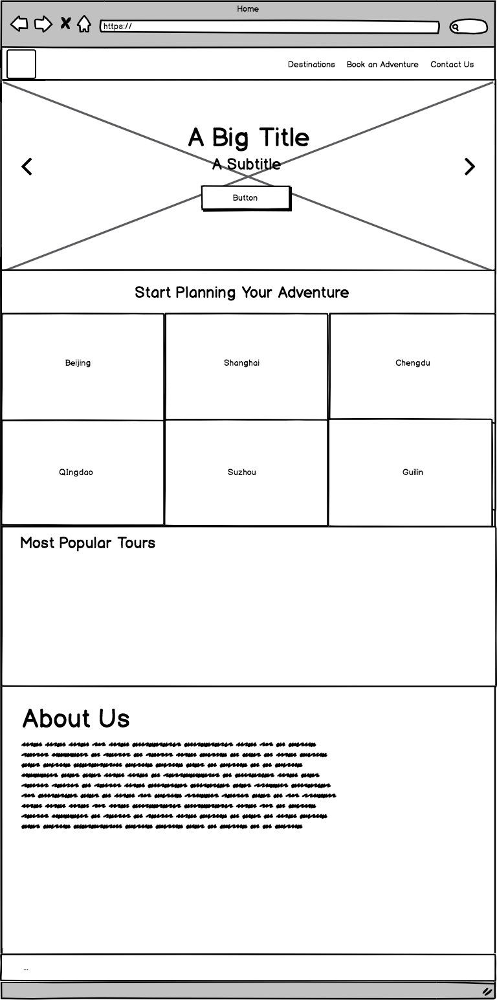
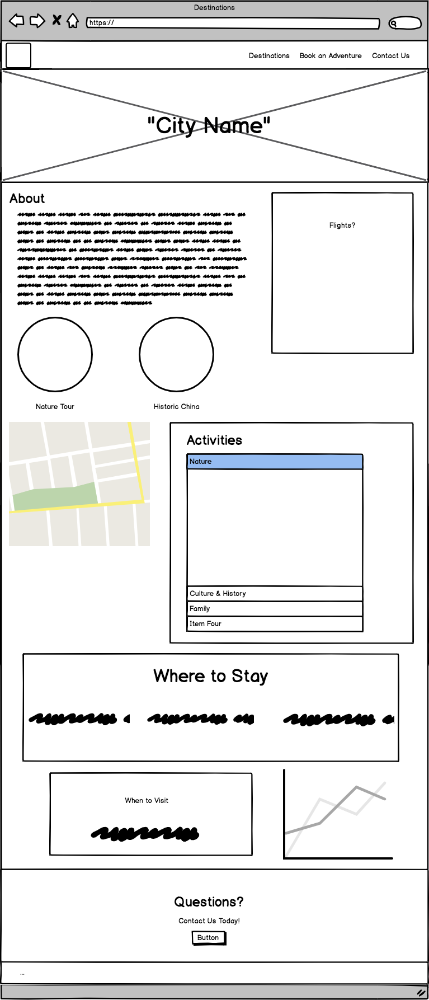
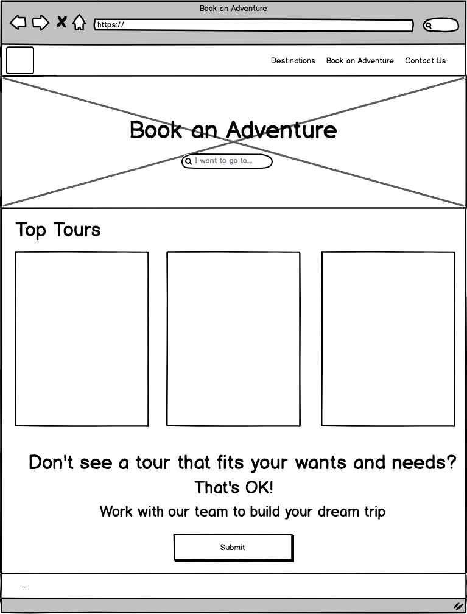
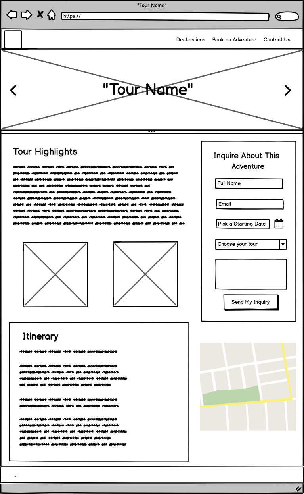
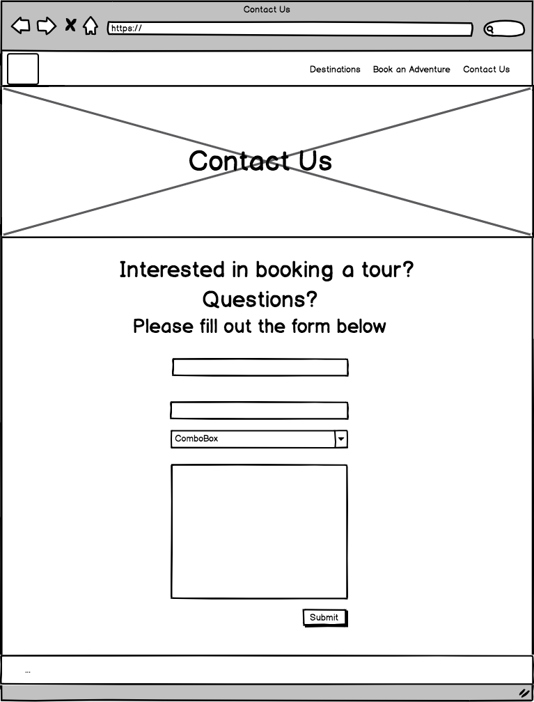
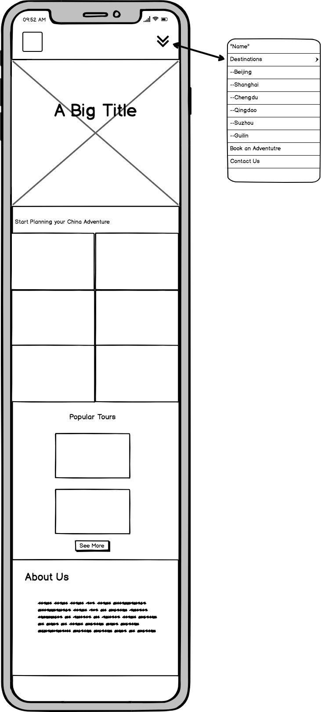
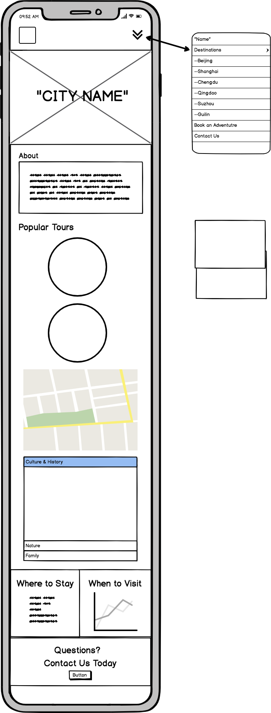
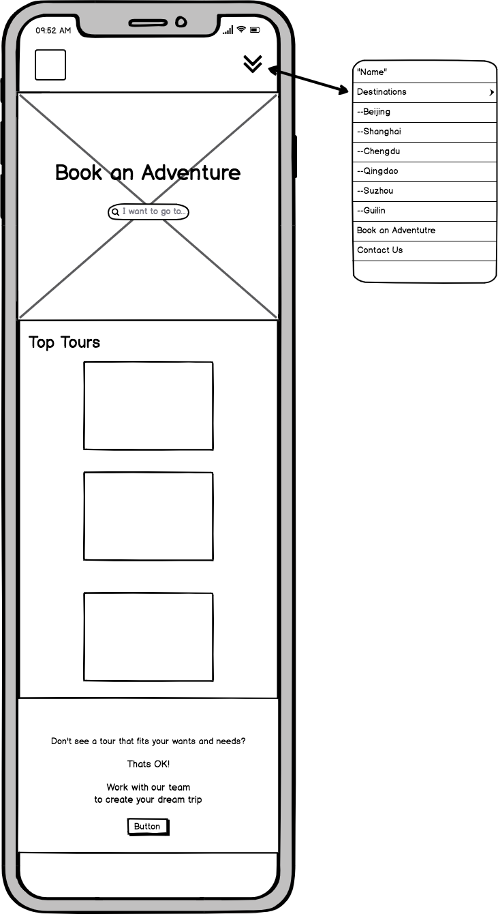
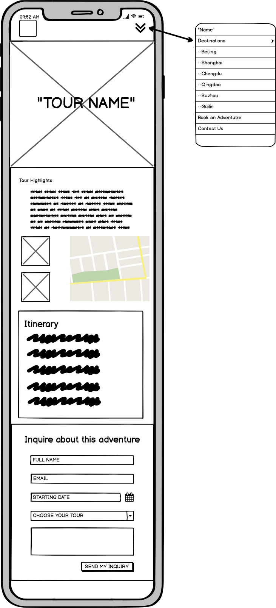

 

# China Travel
This website was created for my second milestone project (Interactive Frontend Development) at Code Institute.

Travel to China has become increasingly popular in recent years with Travel and Leisure naming several Chinese cities as top destinations for 2020. Recently traveling to China myself, I found how difficult it can be to find simple yet clear information on some of the destinations I wanted to travel to. China is a very unique country with an exciting culture that deserves to be explored. 

The site has been designed to present information about the top tourist destinations, present interactive maps that are in English, and place to view and book a tour to several of the cities.

The deployed site can be found here: 
https://amybru.github.io/chinatravel/

## User Experience

#### Target Audience
* Someone who is interested in traveling to China
* A person looking for more information about the largest cities in China
* A tourist looking for a customizable tour to the top tourist destinations in China

#### User Stories

As a user of this website, I want to learn about cities in China and what I can do there.

As a user of this website and someone who plans to visit China, I would like to book and purchase a tour.

As a user of this website, I would like to be able to see different destinations based on my personal preferences.

As the site owner, I would like users to be able to choose a tour package that best suits their needs.

#### Wireframes
All wireframes were created on the website https://balsamiq.com.

Desktop:

Mobile:

The color palate chosen was based on colors that are found to be auspicious in the Chinese culture. The color palate below was found on Pinterest and looks to belong to Sarah Renae Clarks. 

## Main Features
A navigation bar that is fixed to the top of the screen for easy access. 

The navigation bar can be toggled on and off on both Mobile and Tablet screen sizes.

An interractive map powered by the GoogleMaps API along with an accordion filled with top activities in each city will allow the user to browse activities based on their preferences.

A chart located at the bottom of the destination page that contains a visual representation of the average temperatures of that city

Three tours each with their own suggested itinerary and a map showing the route.

A main contact page to allow any user to send in questions or inquire about purchasing a tour package.

#### Features Left to Impliment
I would like to continue to add destination pages highlighting more of the popular tourist destinations in China. 

I would also like to add more tours that the user could book, making it more profitable for the website owner. 

I think it would also be beneficial to add a page explaining useful travel tips and how to apply for a visa.

It would be nice to impliment the skyscanner API to make booking a trip to the city of their choice even more convenient.

## Technologies
#### HTML5:
HTML5 was used to provide the content of the site.
https://en.wikipedia.org/wiki/HTML

#### CSS3:
css3 was used to apply styles to the site.
https://en.wikipedia.org/wiki/Cascading_Style_Sheets

#### Bootstrap 4:
This site uses Bootstrap 4 to add extra features and allow the HTML to be more responsive.
https://en.wikipedia.org/wiki/Bootstrap_(front-end_framework)

#### Javascript
This site uses some js to help the website become more interactive for the user.
https://en.wikipedia.org/wiki/JavaScript

#### jQuery
The site also uses jQuery to add responsiveness.
https://jquery.com/

#### Git & Git Hub
Git and Git Hub were used for version control.
https://en.wikipedia.org/wiki/GitHub

#### GoogleMaps API
The GoogleMaps API was used in two different ways on this website:
1) The six destination pages use the Marker Cluster to show where several top attractions are located in the city.
2) The three tour pages use the map with a polyline to show the suggested itinerary.
https://developers.google.com/maps/documentation

#### Chart JS
The Chart JS library was used to build the charts on each of the six destination pages.
https://www.chartjs.org/

#### Google Fonts
The fonts Dosis and Permanent Marker were used throughout the website.
https://fonts.google.com/

#### Balsamiq
Balsamiq was used to create wireframes.
https://balsamiq.com/

## Testing
Google Chrome Developer tools were used to test the responsiveness of each page and to change the viewport and screen size.

Free Formatter (www.freeformatter.com/html-formatter.html) was used to make sure my HTML was formatted in the proper way. 

HTML was validated at https://validator.w3.org 

css was validated at https://jigsaw.w3.org/css-validator/ 

JS code was validated at https://jshint.com

#### User testing
This project was tested manually on a range of devices and browsers to ensure responsiveness. The following browsers were tested:
* Google Chrome
* Mozzila Firefox
* Safari
* Internet Explorer

The following tests were performed to test usibility and functionality. At the time of a final testing, all features passed the functionality test as expected.
* Using the links in the navigation bar will take the user to the correct page on the website
* Clicking on the logo icon on the navigation bar will bring the user back to the home page
an appropriate PDF in a seperate window.
* Clicking all links on the home page will help the user navigate to the correct page.
* Hovering over the images on the adventuregrid located on the home page will cause the image to zoom in
* Located to the left of the accordion on the desktop, the user can interract with the GoogleMaps API to see where the top activities are located
* Markers are located in the correct postition with the correct geolocations
* On the destinations pages, the user can interact with the cart about the average temperatures in that city throughout the year- This function works best for desktop users. However, mobile users can also view the chart
* Clicking on the button at the bottom of the destination pages will take the user to the contact page
* Clicking each of the three pictures on the "Book an Adventure" page will take the user to the correct tour
* On each of the three tour pages, filling out the inquiry form will send an email to the site owner's email using the EmailJS program
* The user can interact with the GoogleMaps API on the tour pages to see the proposed itinerary
* Filling out the contact form on the contact page will allow the user to send an email to the site owner through the EmailJS program
* In the footer on select desktop pages, clicking the arrow will bring the user back to the top of the page 
* In the footer, clicking the Facebook icon will take the user to https://facebook.com
* In the footer, clicking the Twitter icon will take the user to https://twitter.com
* In the footer, clicking the Google+ icon will take the user to https://google.com
* In the footer, clicking the Instagram icon will take the user to https://instagram.com

## Bugs
The following bugs were found when performing the tests. 

A formating issue existed on the home page where the adventuregrid images were located. The images were meant to zoom in, without increasing in size. Additional styles were applied to correct this.

There was a margin-right that caused a white gap on mobile and tablet screens. This was removed from the css to eliminate this issue.

An issue existed with the GoogleMaps API on the tour pages where the route zig-zagged to many different cites, instead of forming a simple polyline shape. Coordinates were adjusted to create a more simple route.

There was an issue with the Email JS, causing an error message. The libraries were listed out of order and this caused the error message.

A problem also existed with the modal attached to the contact form causing it to display when the page was refreshed. Additonal style and javascript were added to prevent this from happening.

The ChartJS javascript had an issue in displaying the colors of the stacked bar chart. Only one of the bars showed color. The code in the dataset was changed slightly. Instead of using an array, it was changed to a string.

## Deployment
This project was initially built with Amazon Cloud9. After experiencing some issues with this site, I switched to using GitPod to finish the project. A local repository was used to add and commit add any changes or new features to the site. Commits to the local respository were pushed to GitHub.

The repository for this website can be found at this GitHub link: 
https://github.com/amybru/chinatravel

The site was published with GitHub Pages. 
https://amybru.github.io/chinatravel/

To accomplish the publishing of the website, the following steps were carried out:
1) When in the repository, navigate to the settings 
2) Scroll down to GitHub Pages
3) Under the section "Source", there is a box with "None" chosen as the option.
4) Click it and select "master branch"
5) Click on the url to visit the published website

## Acknowledgement
#### I would like to thank and credit the following sources for their help:

* My mentor with Code Institue, Reuben Ferrante

* The community at Slack 

* The videos in the Code Institue course for helping me to understand what each of the elements do

* The Code Institute tutors for helping me to find why the bugs were happening

* Photos of the cities Shanghai (with the exeption of the night picture of the Shanghai Skyline), Qingdao, Suzhou, and those labled as "Garden" were taken myself in 2019. 

* Photos from the cities Beijing, Chengdu, and Guilin are found at the site Unsplash. https://unsplash.com/

* The logo seen in the navbar handdrawn by myself 

* Icons were taken from Ionicons
https://ionicons.com/

* All fonts are from Google Fonts (https://fonts.google.com). 

* The content writen was based on research from my previous trip to China

* Data on the average tempurature was found at https://www.climatestotravel.com/
